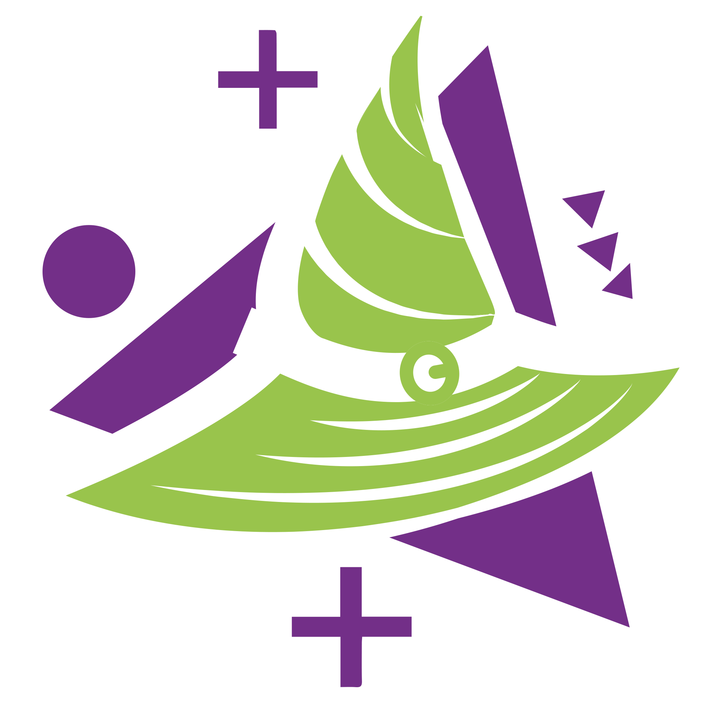

<p align="center"></p>

<h1 align="center">Bruxos do VFX · 3DGS</h1>

<p align="center">Um ateliê mágico para visualizar, animar e renderizar <b>3D Gaussian Splats</b> direto no navegador.</p>

## ✨ O grimório

| Arquivo | Função |
|---|---|
| `outputs/index.html` | Viewer e editor 3DGS independente — basta abrir no navegador. |
| `outputs/ffmpeg_render_server.py` | Ponte local opcional para renderizar vídeo CFR com FFmpeg. |
| `Bruxos_VFX_3DGS.ipynb` | Colab: vídeo → Gaussian Splatting. |
| `Bruxos_VFX_SHARP.ipynb` | Colab: uma foto → splat com Apple SHARP. |
| `Bruxos_VFX_4DGS.ipynb` | Colab: vídeo → sequência 4DGS. |

<p align="center"></p>

<h1 align="center">Bruxos do VFX · 3DGS</h1>

<p align="center">Um ateliê mágico para visualizar, animar e renderizar <b>3D Gaussian Splats</b> direto no navegador.</p>

## ✨ O grimório

| Arquivo | Função |
|---|---|
| `outputs/index.html` | Viewer e editor 3DGS independente — basta abrir no navegador. |
| `outputs/ffmpeg_render_server.py` | Ponte local opcional para renderizar vídeo CFR com FFmpeg. |
| `Bruxos_VFX_3DGS.ipynb` | Colab: vídeo → Gaussian Splatting. |
| `Bruxos_VFX_SHARP.ipynb` | Colab: uma foto → splat com Apple SHARP. |
| `Bruxos_VFX_4DGS.ipynb` | Colab: vídeo → sequência 4DGS. |

## 🔮 Recursos do viewer

- Importa `.ply`, `.splat`, `.ksplat` e sequências 4D; aceita arrastar e soltar.
- Controles de câmera, FOV, fundo, cor, escala, pivô, posição e rotação.
- **Rig de ponto e Box**: selecione regiões, mova, gire e escale Gaussianos com precisão.
- Crop ao vivo por caixa e salvamento do Gaussian recortado.
- Distorções e efeitos GPU: waves, ripple, twist, bend, taper, wobble, dissolve, fumaça, luzes, relight, profundidade, névoa, chroma, AOV e mais.
- Aba **Experimental/Cinema**: grading, tone mapping, bloom, aberração, vinheta, grão, tilt-shift, desfoque de lente e presets visuais.
- Texto em Gaussians com aparência, cor, profundidade e animações criativas.
- **Timeline** com REC de câmera, keyframes, editor de curvas, presets de easing e duração em segundos.
- **Mix**: importa até 8 Gaussianos na mesma cena, com layers, visibilidade, transformação e keyframes por layer.
- Presets locais ou em arquivo `.json`, incluindo controles, rig, câmera e timeline.
- Interface PT/EN, painel glass e controles pensados para desktop e celular.

## 🎬 Render e gravação

- Gravação rápida pelo navegador em **24 fps**.
- Render da timeline em **24 ou 25 fps**, 720p, 1080p ou UHD.
- Exporta sequência PNG em ZIP — segura para ComfyUI — ou vídeo CFR por FFmpeg: **H.264, HEVC/H.265 e ProRes 422**.
- O render quadro a quadro prioriza frames estáveis, mesmo que leve mais tempo.

## 🪄 Começo rápido

1. Abra `outputs/index.html`.
2. Importe um `.ply`, `.splat` ou `.ksplat`.
3. Use **Editar** para transformar a cena, **Rig** para deformar regiões e **Timeline** para animar.
4. Em **Mix**, adicione outras cenas como layers quando precisar compor.
5. Salve um preset ou renderize a timeline.

Para vídeo CFR, mantenha o serviço local aberto:

```bash
py -3 outputs/ffmpeg_render_server.py
```

## 🎥 Criar um splat a partir de vídeo

Grave uma órbita lenta do objeto ou ambiente, com boa luz e foco. No Colab, ative uma GPU e rode o notebook de criação na ordem. O resultado pode ser importado diretamente no viewer.

[](https://colab.research.google.com/github/nyckm/3dGS_WebEDIT/blob/main/Bruxos_VFX_3DGS.ipynb)

## ⚙️ Créditos

[GaussianSplats3D](https://github.com/mkkellogg/GaussianSplats3D) · [Three.js](https://threejs.org) · [Nerfstudio / splatfacto](https://docs.nerf.studio) · [Apple SHARP](https://github.com/apple/ml-sharp)

---

<p align="center">Feito com 💜, pixels e um pouco de magia por <b>Bruxos do VFX</b>.</p>


## 🔮 Recursos do viewer

- Importa `.ply`, `.splat`, `.ksplat` e sequências 4D; aceita arrastar e soltar.
- Controles de câmera, FOV, fundo, cor, escala, pivô, posição e rotação.
- **Rig de ponto e Box**: selecione regiões, mova, gire e escale Gaussianos com precisão.
- Crop ao vivo por caixa e salvamento do Gaussian recortado.
- Distorções e efeitos GPU: waves, ripple, twist, bend, taper, wobble, dissolve, fumaça, luzes, relight, profundidade, névoa, chroma, AOV e mais.
- Aba **Experimental/Cinema**: grading, tone mapping, bloom, aberração, vinheta, grão, tilt-shift, desfoque de lente e presets visuais.
- Texto em Gaussians com aparência, cor, profundidade e animações criativas.
- **Timeline** com REC de câmera, keyframes, editor de curvas, presets de easing e duração em segundos.
- **Mix**: importa até 8 Gaussianos na mesma cena, com layers, visibilidade, transformação e keyframes por layer.
- Presets locais ou em arquivo `.json`, incluindo controles, rig, câmera e timeline.
- Interface PT/EN, painel glass e controles pensados para desktop e celular.


## 🎬 Render e gravação

- Gravação rápida pelo navegador em **24 fps**.
- Render da timeline em **24 ou 25 fps**, 720p, 1080p ou UHD.
- Exporta sequência PNG em ZIP — segura para ComfyUI — ou vídeo CFR por FFmpeg: **H.264, HEVC/H.265 e ProRes 422**.
- O render quadro a quadro prioriza frames estáveis, mesmo que leve mais tempo.

## 🪄 Começo rápido

1. Abra `outputs/index.html`.
2. Importe um `.ply`, `.splat` ou `.ksplat`.
3. Use **Editar** para transformar a cena, **Rig** para deformar regiões e **Timeline** para animar.
4. Em **Mix**, adicione outras cenas como layers quando precisar compor.
5. Salve um preset ou renderize a timeline.

Para vídeo CFR, mantenha o serviço local aberto:

```bash
py -3 outputs/ffmpeg_render_server.py
```

https://github.com/user-attachments/assets/7bf376ab-1881-4938-a45f-9c594c952238


## 🎥 Criar um splat a partir de vídeo

Grave uma órbita lenta do objeto ou ambiente, com boa luz e foco. No Colab, ative uma GPU e rode o notebook de criação na ordem. O resultado pode ser importado diretamente no viewer.

[](https://colab.research.google.com/github/nyckm/3dGS_WebEDIT/blob/main/Bruxos_VFX_3DGS.ipynb)

## ⚙️ Créditos

[GaussianSplats3D](https://github.com/mkkellogg/GaussianSplats3D) · [Three.js](https://threejs.org) · [Nerfstudio / splatfacto](https://docs.nerf.studio) · [Apple SHARP](https://github.com/apple/ml-sharp)

---

<p align="center">Feito com 💜, pixels e um pouco de magia por <b>Bruxos do VFX</b>.</p>
